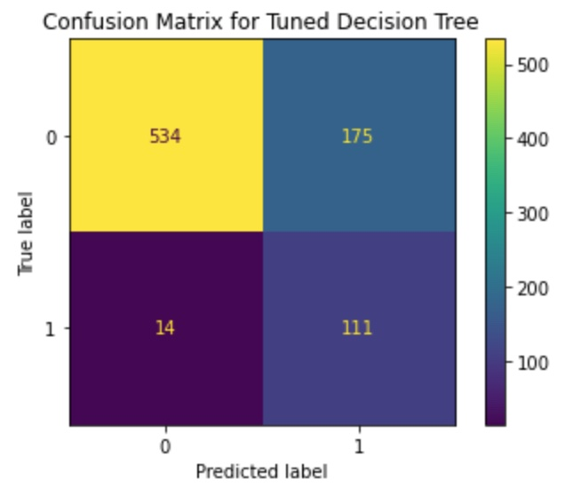

# Telecom Churn Analysis & Modeling

## Overview

This project utilizes a dataset of customers from the telecommunications company SyriaTel, analyzing the churn rate of customers (number of customers that stop doing business with the company) by identifying patterns amongst customer features. Additionally, several classification models are built and tuned, then compared to choose the best model for predicting whether customers will stop doing business.  

## Business Problem

The telecom company SyriaTel is concerned with their profits related to customer retention. They want to reduce the amount of money lost because of customers that don't remain with the company for very long. The task is to build a classifier to predict if a customer will soon stop doing business with SyriaTel, by looking for any predictable patterns. 

## Data Understanding

The dataset used for this project is a csv file ("churn_data.csv"), containing over 3,000 customer records and 21 columns. These columns include information on whether they have an international plan or voice mail plan, the totality of calls made and minutes spent on the phone, and the number of calls made to customer service. The target feature is the final column labeled "churn", a binary column indicating whether or not they stopped doing business with the company.  


## Methods

This project uses descriptive analysis, exploratory data analysis, data visualization, and model building/tuning. This provides key insights to optimizing the predictive ability of customers' status and outcomes with the company.

## Results

There is a strong relationship between the number of customer service calls and whether a customer stops doing business. 


The minutes spent and whether customers have voicemail and international plans are very useful for predicting whether they'll stay with the company.


Our final model has a good recall score, indicating its effectiveness in catching all cusomters who will cease ties with the company.


## Conclusions

The conducted analysis leads to the following findings and recommendations: 

- **Customer Service Calls are a good indicator.** Generally speaking, two or more calls to customer service are a good predictor that the customer may soon cease business. 
- **Total minutes on phone calls can predict outcome.** Some of the most important features towards predicting whether a customer will cease business include the total minutes they've spent on the phone. 
- **Recall is the ideal metric for our model.** The final model we settled on has a very high recall score, indicating that it is unlikely to miss any customers that cease business with the company. 

## For More Information

See the full analysis in the [Jupyter Notebook](./notebook.ipynb) or review this [presentation](./presentation.pdf).

See the dataset used by clicking [here](./churn_data.csv/).

Author: Christopher Miley 

March 29, 2024

## Repository Structure

```
├── images
├── README.md
├── churn_data.csv
├── notebook.ipynb
└── presentation.pdf
```